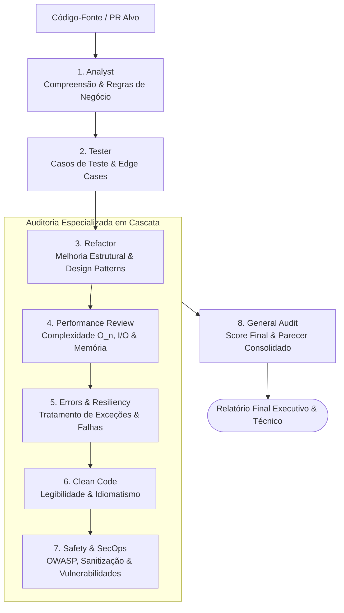

# ⚡ Multi-Agent Code Review & Audit Pipeline

> **Pipeline autônomo e modular de agentes de IA para análise profunda, geração de testes, refatoração e auditoria multidimensional de código-fonte — rodando 100% local via Ollama.**

[](https://python.org)
[](https://ollama.com)
[](#)

---

## 📌 Sobre o Projeto

O **Multi-Agent Code Review & Audit Pipeline** automatiza o ciclo completo de garantia de qualidade (QA) e revisão de código através de uma esteira encadeada de agentes inteligentes especializados.

Diferente de soluções dependentes de nuvem, o pipeline foi desenhado para operar **localmente via Ollama**, garantindo que nenhum código proprietário saia da sua máquina ou infraestrutura privada.

Em vez de uma única chamada monolítica, o fluxo divide as responsabilidades em etapas lógicas e modulares: desde a dissecação funcional até análises críticas de segurança, performance e clareza estrutural.

---

## 🏗️ Arquitetura do Pipeline

O fluxo de execução orquestrado por `run_pipeline.py` segue as etapas abaixo:



---

## 📂 Estrutura de Arquivos

```text
agents-main/
├── prompts/
│   ├── 1_analyst.md         # Análise estrutural e mapeamento de contexto
│   ├── 2_tester.md          # Geração de suítes de testes unitários/integração
│   ├── 3_refactor.md        # Sugestões de design e refatoração arquitetural
│   ├── 4_review_perf.md     # Auditoria de performance e consumo de recursos
│   ├── 5_review_errors.md   # Análise de resiliência e tratamento de exceções
│   ├── 6_review_clean.md    # Validação de Clean Code e manutenibilidade
│   ├── 7_review_safety.md   # Detecção de vulnerabilidades e brechas de segurança
│   └── 8_general_audit.md   # Sumário executivo, checklist e score final
├── run_pipeline.py          # Script orquestrador da esteira de agentes
├── .gitignore               # Configurações de exclusão do Git
└── README.md                # Documentação técnica do projeto
```

---

## 🚀 Como Começar

### Pré-requisitos

1. **Python 3.10+** instalado
2. **[Ollama](https://ollama.com/)** instalado e em execução no sistema

---

### 1. Baixar o Modelo no Ollama

Certifique-se de que o daemon do Ollama está rodando e baixe o modelo que você utiliza (ex: família Qwen 2.5 / Llama):

```bash
# Exemplo com Qwen 2.5 Coder (recomendado para código):
ollama pull qwen2.5-coder:7b

# Ou versão menor para máquinas mais modestas:
ollama pull qwen2.5-coder:1.5b
```

> **Dica:** O Ollama roda por padrão no endereço `http://localhost:11434`.

---

### 2. Clonar o Repositório e Criar Ambiente Virtual

```bash
git clone https://github.com/seu-usuario/agents.git
cd agents-main

# Criar ambiente virtual
python -m venv .venv

# Ativar o ambiente
# Linux / macOS:
source .venv/bin/activate
# Windows (PowerShell):
.venv\Scripts\Activate.ps1
# Windows (CMD):
.venv\Scripts\activate.bat
```

---

### 3. Instalar Dependências

Instale os pacotes necessários (incluindo o client oficial do Ollama):

```bash
pip install ollama
```


---

## 🛠️ Executando a Pipeline

Para rodar a esteira completa sobre um arquivo de código:

```bash
# Execução básica apontando para o arquivo alvo
python run_pipeline.py ./my_code.py

```

---

## 🎯 Especialidades de Cada Agente

| # | Agente | Responsabilidade Principal |
|---|---|---|
| **01** | `Analyst` | Disseca o propósito do código, dependências e fluxo de dados. |
| **02** | `Tester` | Identifica caminhos felizes, bordas (*edge cases*) e propõe testes automatizados. |
| **03** | `Refactor` | Aplica princípios SOLID, DRY e simplificação de lógica complexa. |
| **04** | `Review Perf` | Avalia complexidade de tempo/espaço ($O(n)$), gargalos de I/O e uso de memória. |
| **05** | `Review Errors` | Mapeia falhas silenciosas, exceções não tratadas e pontos de instabilidade. |
| **06** | `Review Clean` | Garante padrões idiomáticos, nomenclatura clara e documentação assertiva. |
| **07** | `Review Safety` | Verifica vulnerabilidades comuns (injeções, secrets hardcoded, sanitização). |
| **08** | `General Audit` | Consolida o parecer, pondera os riscos e emite a nota/aprovação final. |

---

## ⚙️ Personalização de Prompts

Cada agente possui instruções modulares em arquivos Markdown dentro de `prompts/`. Você pode refinar o comportamento de qualquer etapa alterando diretamente o arquivo correspondente, sem necessidade de modificar a lógica de orquestração do `run_pipeline.py`.

---

## 🤝 Contribuindo

1. Faça um Fork do projeto
2. Crie uma branch para a sua feature (`git checkout -b feature/new-agent`)
3. Faça o commit das alterações (`git commit -m 'feat: adiciona agente de documentação'`)
4. Envie para o branch (`git push origin feature/new-agent`)
5. Abra um **Pull Request**

---

## 📄 Licença

Distribuído sob a licença MIT. Consulte `LICENSE` para mais detalhes.